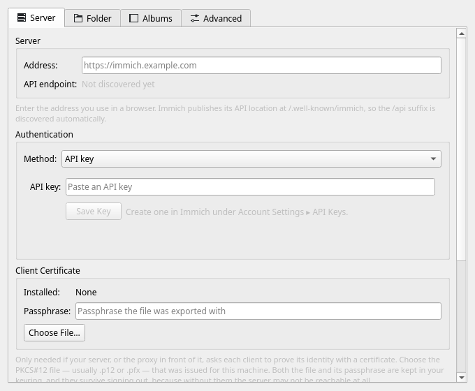
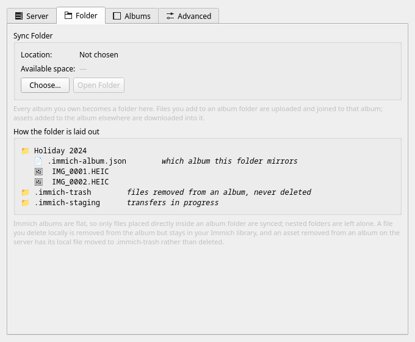
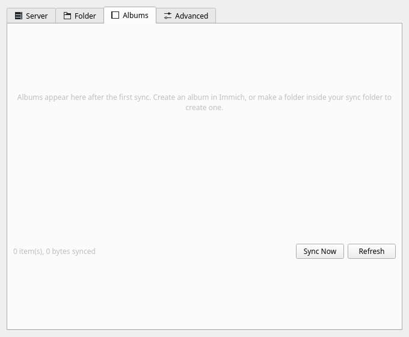
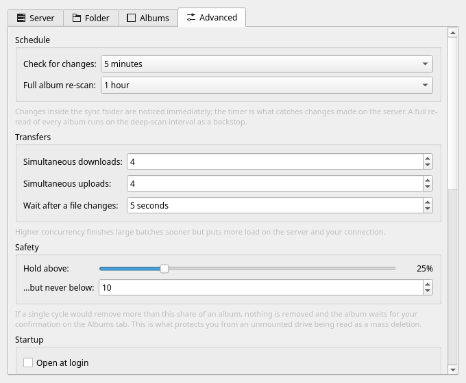

<div align="center">


# Immich KSync

**Your [Immich](https://github.com/immich-app/immich) albums, as ordinary folders on your desktop.**

[](https://github.com/GnumBix/immich-ksync/actions/workflows/ci.yml)
[](LICENSE)
[](#requirements)
[](#from-source)

</div>

A native KDE system-tray agent that works with the immich server and syncs albums as folders on disk.

Every album you own becomes a real folder full of real files. Dolphin, digiKam, `rsync`
and your backup tool all see them, because they are just files. The app renders nothing —
no thumbnails, no gallery, no previews. It is a sync daemon with a menu and a settings
window.

Built against the stock Immich API, so it works with any unmodified server. Written
against the 3.2 API surface, with a fallback for older servers.

> This is an independent client. It is not affiliated with or endorsed by the Immich
> project.

I have been using Immich on my mobile devices for a long time, but I always found it inconvenient on desktop
computers. I wanted a way to synchronize image galleries as local folders on my PC—a feature
that the official Immich client did not offer.

So, I decided to write my own client. As I started using it, I encountered and fixed numerous bugs
along the way. It soon became clear that I wasn't the only one who needed this;
several acquaintances asked me to share it with them as well. This ultimately led me to make the tool
available to everyone.

## What it does

```
~/Pictures/Immich/
├── Holiday 2024/
│   ├── .immich-album.json      which album this folder mirrors
│   ├── IMG_0001.HEIC
│   └── IMG_0002.HEIC
├── Weekend in Rome/
│   └── …
├── .immich-trash/              files removed from an album — never deleted
└── .immich-staging/            transfers in progress
```

| You do this                             | The app does this                                                       |
|-----------------------------------------|-------------------------------------------------------------------------|
| Drop a photo into an album folder       | Uploads it and adds it to that album                                    |
| Add an asset to an album in Immich      | Downloads it into the folder                                            |
| Delete a local file                     | Removes that asset from the album — **it stays in your Immich library** |
| Remove an asset from an album in Immich | Moves the local file to `.immich-trash` — **never deletes it**          |
| Rename a folder                         | Renames the album                                                       |
| Rename an album in Immich               | Renames the folder                                                      |
| Create a folder with photos in it       | Creates an album and uploads them                                       |
| Copy one photo into two album folders   | Uploads it **once**; it joins both albums                               |

Nothing is ever destroyed locally, and no asset is ever removed from your Immich
library. The strongest action in either direction is "remove from album" or "move to a
trash folder you control".

### The safety gate

Two-way sync cannot tell "the user deleted these" from "the drive is not mounted". If a
single cycle would remove more than 25% of an album (and more than 10 items), nothing is
removed. The album is put on hold, a notification appears, and Settings ▸ Albums offers
two ways out:

- **Apply Removals** — yes, I meant it.
- **Restore Files from Immich** — no, fetch them back.

Reconnecting the drive resolves the hold on its own.

## What it looks like

The system tray is the whole interface: a status line, then **Resume**/**Pause**,
**Sync Now**, **Settings…** and **Quit**. Everything else lives in four settings tabs.

| Server | Folder |
|---|---|
|  |  |
| Address, credentials, optional TLS client certificate and private certificate authority, and a connection test that names any missing API-key permission before the first sync can fail on one. | Where the album folders live, with a plain-language map of what the app writes to disk. |

| Albums | Advanced |
|---|---|
|  |  |
| Every album with a per-album on/off switch — and any album the safety gate is holding, with both ways to resolve it. | Intervals, concurrency, the safety threshold, open-at-login, and a live log. |

## Requirements

- KDE Plasma 6 (it works on any desktop with a StatusNotifierItem host, but Plasma is
  what it is built and tested against)
- Qt 6.5 or later and KDE Frameworks 6
- A secret service for credential storage — `ksecretd` or `kwalletd6` on Plasma,
  `gnome-keyring` elsewhere
- An Immich server, and either an API key or an account password

## Install

### From a package

An RPM spec, a Flatpak manifest and an AppImage recipe live in [`packaging/`](packaging/).
The native package is the one to prefer: the Flatpak sandbox needs broad filesystem
access for an arbitrary sync folder, and cannot see a drive mounted outside the portal.

### From source

```bash
git clone https://github.com/GnumBix/immich-ksync.git
cd immich-ksync
make run
```

There are no third-party dependencies and nothing to resolve over the network: the app
uses only Qt 6, KDE Frameworks 6, SQLite and the C library. `make help` lists the other
targets.

```bash
make install PREFIX=~/.local
```

## Setting it up

1. Launch the app. It appears in the system tray; there is no window until you open
   Settings.
2. **Settings ▸ Server** — enter the address you use in a browser
   (`https://immich.example.com`). The `/api` suffix is discovered automatically through
   `/.well-known/immich`.
3. Choose **API key** or **Email & password**.
   - An API key needs these nine permissions. **Test Connection** names any that are
     missing rather than letting the first sync fail halfway through:

     `album.read` · `album.create` · `album.update` · `albumAsset.create` ·
     `albumAsset.delete` · `asset.read` · `asset.upload` · `asset.download` · `user.read`

     Note that `asset.delete` is *not* among them: the app is not capable of deleting an
     asset from your library.
   - With email and password, the password is exchanged once for a session token and is
     never stored. Only the token is kept, in your keyring.
4. If your server sits behind mutual TLS, or its certificate comes from a private
   certificate authority, **Settings ▸ Server** has a section for each. Both are
   optional and most people need neither.
   - **Client certificate** — the `.p12` or `.pfx` issued for this machine, and its
     passphrase.
   - **Private certificate authority** — the certificate of the authority that signed
     your server's certificate, in PEM or DER. It is added as an extra anchor **for
     your server's address only**; the hostname and the expiry are still checked, and
     this is not a switch that accepts any certificate.

   Both are kept when you sign out, since without them the server may not be reachable
   at all, and are removed only by the Remove button beside them.
5. **Settings ▸ Folder** — choose where the album folders should live.
6. The tray shows what it is doing. **Pause** stops it; **Resume** starts an immediate
   cycle.

Albums you own are synced by default. Uncheck any of them in **Settings ▸ Albums**.
Albums shared *with* you by other people are not synced.

## How it works

A cycle runs on a timer (5 minutes by default), when the folder watcher reports a change
under the sync folder, when the network comes back, and after the machine wakes.

Each cycle reconciles three snapshots per album: what the **server** has, what is on
**disk**, and the **baseline** — what the last cycle agreed on, stored in SQLite.

| Server | Disk | Baseline | Meaning                    | Action                           |
|:------:|:----:|:--------:|----------------------------|----------------------------------|
|   ✓   |  ✓  |     –    | Both sides already agree   | Record the baseline              |
|   ✓   |  ✓  |    ✓    | Steady state               | Nothing                          |
|   ✓   |  –   |    –     | New on the server          | Download                         |
|   ✓   |  –   |    ✓    | Deleted locally            | Remove from the album            |
|   –    |  ✓  |    –     | New local file             | Upload, then add to the album    |
|   –    |  ✓  |    ✓    | Removed from the album     | Move the file to `.immich-trash` |
|   –    |  –   |    ✓    | Gone from both sides       | Forget it                        |

The baseline is what makes this a synchroniser rather than a merger. Without it,
"deleted here" and "added there" are the same observation, and every deletion would
resurrect itself on the next cycle.

Some details that matter in practice:

- **Identity is the SHA-1 checksum**, the same one Immich uses for deduplication. That is
  the only identifier a local file and a remote asset share.
- **Files are hashed once.** A cache keyed on `(device, inode, size, nanosecond mtime)`
  means a cycle costs time proportional to what changed, not to library size.
- **Album folders carry a marker** (`.immich-album.json`) recording the album ID, its
  name and the folder's name. That makes renames on either side unambiguous and lets the
  whole database be rebuilt from disk if it is lost.
- **Cheap change detection.** Adding assets bumps an album's `updatedAt`; removing them
  changes its `assetCount`. When both match what was stored, membership cannot have
  changed and no asset listing is fetched. A full re-scan runs hourly as a backstop.
- **Downloads are atomic.** Files land in `.immich-staging`, are verified against the
  expected checksum, and are then renamed into place. A partial download is never visible.
- **Half-copied files are left alone.** Anything modified within the last few seconds is
  deferred, and no removals are inferred from a cycle that could not read a folder
  completely.
- **Repeated failures back off** (1 min → 4 min → … → 6 h), so one unreadable file cannot
  occupy a transfer slot on every cycle.
- **Signing in as a different account clears the local state**, because one account's
  baselines would make another account's assets look like local deletions.

### Linux specifics

- **Change notification is inotify**, through `KDirWatch`.It
  needs one watch per directory, so the root and each album folder get one — the layout
  is shallow by design, and the count stays proportional to albums, not photos. inotify
  does not fire on NFS or SMB mounts; the interval timer is the backstop, and the app
  says so in the log when it notices.
- **Birth time comes from `statx`.** ext4 and btrfs report it; NFS and some FUSE
  filesystems do not, and the app falls back to the modification time. Uploads already
  send the earlier of the two, so nothing changes when it is missing.
- **Credentials live in the Secret Service** (`org.freedesktop.secrets`) — `ksecretd` on
  Plasma 6, `kwalletd6` or `gnome-keyring` elsewhere. Nothing is written to the config
  file or the database.
- **The sync folder is warned about** when it sits on a network share, a FUSE mount such
  as a cloud drive, an overlay filesystem, or inside the trash. Each of those breaks file
  identity or change notification in a way that would otherwise look like data loss.

### Compatibility

`POST /search/metadata` rejects requests that mix the pre-3.2 flat fields with the 3.2
`filter`/`cursor` shape. The app probes `/server/version` and uses cursor pagination on
3.2 and newer, page numbers on older servers.

Uploads follow the official CLI exactly: `bulk-upload-check` in batches of 5000 hex SHA-1
checksums, then a streamed `multipart/form-data` POST with an `x-immich-checksum` header.
XMP sidecars (`photo.xmp` or `photo.ext.xmp`) ride along with their asset.

## Not in scope

- Assets that are in no album — the sync unit is the album.
- Albums shared with you by other people.
- Nested folders inside an album folder. Immich albums are flat, so they are reported and
  skipped rather than silently flattened.
- Live Photo pairing on upload: the still and the video upload as separate assets, which
  matches the CLI.
- Stacks, tags, people, memories and per-asset metadata.

## Layout

```
src/
├── app/           entry point, composition root, D-Bus system events
├── tray/          the StatusNotifierItem and its menu
├── settings/      Server · Folder · Albums · Advanced
├── core/          logging, retry/backoff, bounded concurrency, checksums, preferences
├── immich/        client, transport, DTOs, discovery, multipart, error mapping
├── credentials/   Secret Service storage, the permission model, TLS certificates
├── storage/       SQLite wrapper, migrations, reconciliation state
├── filesystem/    scanning, hashing, atomic writes, KDirWatch, local trash
├── sync/          planner (pure), safety gate, executor, engine
└── notifications/ the two alerts worth interrupting someone for
```

`src/sync/SyncPlanner.cpp` is a pure function over three snapshots and holds the
interesting logic; it is where the tests point. Everything except `app/`, `tray/` and
`settings/` builds into a static library the tests link against, so a headless test run
needs neither a display nor a session bus.

## Tests

```bash
make test                                     # hermetic: unit + interface, nothing external
make test-live IMMICH_TEST_SERVER=http://localhost:2283 IMMICH_TEST_API_KEY=…
./tools/run-tls-test-server.sh & make test-tls # mutual TLS, against a throwaway server
make snapshots                                # render the settings tabs to PNGs
```

## Contributing

See [CONTRIBUTING.md](CONTRIBUTING.md). The short version: anything that can remove a
file or an album entry needs a test.

Security reports go through [SECURITY.md](SECURITY.md), not public issues.

## Licence

[AGPL-3.0](LICENSE), the same licence Immich uses.

Copyright © 2026 GnumBix. This project contains no Immich code — it speaks the public
HTTP API only.
